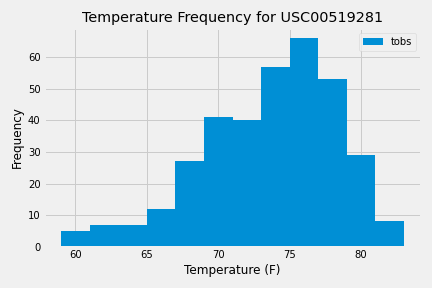

# Climate_Analysis_and_App_with_SQLAlchemy_and_Flask_API
Climate Analysis and App with SQLAlchemy and Flask API

The purpose this project is to analyze the weather data provided using SQLAlchemy and Flask API. 

## Table of Contents 
* [General Info](#General-info)  
* [Technologies](#technologies)  
* [Setup](#setup)  
* [Data Sources](#data-sources)
* [Images](#images)  
* [Overview](#overview)  

## General Info
This code is to analyze the provided temperature, precipitation, and station information.

## Technologies
Project is created with:  
* Pandas 1.0.5  
* Jupyter Notebook 4.6.3  
* Matplotlib 3.3.2  
* Python 3.6.10
* SQLAlchemy 1.3.22
* Flask 1.1.2

## Setup
To run the climate analysis, you will need to open the file in Jupyter Notebook. The App can be ran using python. 

## Data Sources 
The data is provided in the Resources folder. 

## Images
There are 2 saved images from this data. The first is a bar graph detailing the precipitation recorded over the last year of the data provided from all the stations. The second is a frequency histogram showing the frequency of temperatures at the station that had the most observations listed in the data. 

Image 1:  Precipitation
  
Image 2:  Temperature Frequency
  

## Overview
The date provided is for 9 stations that include the temperature and precipitation recorded. All the stations are in Hawaii. From the data we can extrapolate that station USC00519281 in Waihee, Hawaii has the most observations in the data provided. The last date recorded in the data set is 2017-08-23. The climate app shows the precipitation data for the last year, the station information, and the information for the station USC00519281 already filtered out. It also allows the user to provide a date, and it will find the min, max, and average for that date to the last date provided. In the Jupyter Notebook, we can see that for Station USC00519281, the temperature is most frequently around 75 degrees Fahrenheit. 