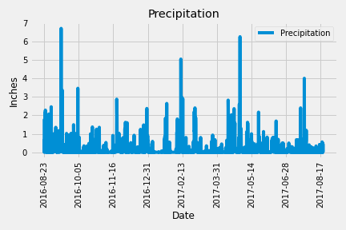

# Climate_Analysis_and_App_with_SQLAlchemy_and_Flask_API
Climate Analysis and App with SQLAlchemy and Flask API

The purpose this project is to analyze the weather data provided using SQLAlchemy and Flask API. 

## Table of Contents 
* [General Info](#General-info)  
* [Technologies](#technologies)  
* [Setup](#setup)  
* [Data Sources](#data-sources)
* [Images](#images)  
* [Overview](#overview)  

## General Info
This code is to analyze the provided temperature, precipitation, and station informaton.

## Technologies
Project is created with:  
* Pandas 1.0.5  
* Jupyter Notebook 4.6.3  
* Matplotlib 3.3.2  
* Python 3.6.10
* SqlAlchemy 1.3.22
* Flask 1.1.2

## Setup
To run the climate analysis, you will need to open the file in Jupyter Notebook. The App can be ran using python. 

## Data Sources 
The data is provided in the Resources folder. 

## Images
There are 3 saved images from this data. The first is a bargraph detailing the precipition recorded over the last year of the data. The second are the frequency at which temperatures occur at the most 

Image 1:  City Latitude vs Max Temp from WeatherPy  
  
Image 2:  City Latitude vs Humidity from WeatherPy  
  
Image 3:  City Latitude vs Cloudiness from WeatherPy  
  

## Overview
